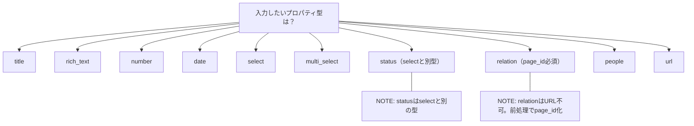

# T-03 API連携仕様書

> 正本: 本リポジトリ（GitHub）。Notion 上のページは配布・レビュー用。

## このページの目的

本ページは、AIやMCP経由で案件・クライアントCRMの各データベースにレコードを自動作成する際に、**AI側に渡す「入力仕様書」** です。

**含まれる定義：**

- **用語定義** — 各プロパティ型（`title` / `rich_text` / `select` / `status` / `relation` など）のJSON記法と使い分けルール
- **作成定義** — 商談パイプラインDB・案件DB・コミュニケーションログDBへの `pages.create` リクエストの具体的なJSON構造
- **前処理・制約** — URL→page_id変換、双方向リレーションの注意点、rich_textの文字数制限

**想定する利用シーン：**

Notion公式API（`@notionhq/client`）やMCP連携で、会話ログ・議事録・メールなどからCRMへ自動転記する際に、このページをAIへのコンテキストとして渡してください。

---

## 1. 共通チートシート（プロパティ型）

> `select` と `status` は書き方が違うので注意。`text`/`内容`/`次アクション` のような文字列は **rich_text** で統一するのが安全です。



```json
// title
"商談名": { "title": [{ "text": { "content": "..." } }] }
// rich_text
"次アクション": { "rich_text": [{ "text": { "content": "..." } }] }
// number
"請求金額（円）": { "number": 1200000 }
// date
"次アクション期限": { "date": { "start": "2026-03-12", "end": null } }
"日時": { "date": { "start": "2026-03-11T16:00:00+09:00", "end": null } }
// select
"優先度": { "select": { "name": "高" } }
// multi_select
"評価軸": { "multi_select": [{ "name": "品質" }, { "name": "スピード" }] }
// status
"フェーズ": { "status": { "name": "交渉" } }
// relation (page_id)
"クライアント": { "relation": [{ "id": "PAGE_ID" }] }
// people
"担当": { "people": [{ "object": "user", "id": "USER_ID" }] }
// url
"スレッドリンク": { "url": "https://..." }
```

---

## 2. 前処理：URL → page_id

- relation は **URL禁止**。
- 入力がURLの場合は、末尾32文字（ハイフン除く）を抽出して page_id に正規化する。

---

## 3. pages.create 例（商談パイプラインDB）

```json
{
  "parent": { "database_id": "DEALS_DATABASE_ID" },
  "properties": {
    "商談名": { "title": [{ "text": { "content": "株式会社ブライトウェブ UI刷新（要件定義〜プロトタイプ）" } }] },
    "クライアント": { "relation": [{ "id": "CLIENT_PAGE_ID" }] },
    "フェーズ": { "status": { "name": "交渉" } },
    "確度": { "select": { "name": "B（60-89%）" } },
    "流入経路": { "select": { "name": "既存顧客" } },
    "予想受注額（円）": { "number": 1200000 },
    "次アクション": { "rich_text": [{ "text": { "content": "最終見積の提示→決裁者レビュー日程確定" } }] },
    "次アクション期限": { "date": { "start": "2026-03-12" } },
    "判断ステップ": { "select": { "name": "STEP3_契約判断" } },
    "評価軸": { "multi_select": [{ "name": "品質" }, { "name": "スピード" }, { "name": "相性" }, { "name": "リスク低減" }] },
    "制約条件": { "multi_select": [{ "name": "期限" }, { "name": "体制" }, { "name": "既存ツール縛り" }] }
  },
  "children": [
    { "object": "block", "type": "heading_2", "heading_2": { "rich_text": [{ "text": { "content": "判断・決定サマリ" } }] } },
    { "object": "block", "type": "bulleted_list_item", "bulleted_list_item": { "rich_text": [{ "text": { "content": "決定事項：主要10〜12画面、追加はオプション扱い" } }] } }
  ]
}
```

---

## 4. pages.create 例（案件DB）

```json
{
  "parent": { "database_id": "PROJECTS_DATABASE_ID" },
  "properties": {
    "案件名": { "title": [{ "text": { "content": "株式会社ブライトウェブ UI刷新（要件定義〜プロトタイプ）" } }] },
    "クライアント": { "relation": [{ "id": "CLIENT_PAGE_ID" }] },
    "ステータス": { "status": { "name": "進行中" } },
    "優先度": { "select": { "name": "高" } },
    "期間": { "date": { "start": "2026-03-10", "end": "2026-04-25" } },
    "請求金額（円）": { "number": 1200000 },
    "請求ステータス": { "select": { "name": "未請求" } },
    "次回アクション日": { "date": { "start": "2026-03-13" } },
    "契約形態": { "select": { "name": "準委任" } },
    "案件タイプ": { "select": { "name": "新規制作" } },
    "請求サイクル": { "select": { "name": "一括" } },
    "入金予定日": { "date": { "start": "2026-05-10" } }
  },
  "children": [
    { "object": "block", "type": "heading_2", "heading_2": { "rich_text": [{ "text": { "content": "作業内訳（統合）" } }] } },
    { "object": "block", "type": "bulleted_list_item", "bulleted_list_item": { "rich_text": [{ "text": { "content": "情報設計・サイトマップ（2026-03-10〜2026-03-25 / 400,000円）" } }] } }
  ]
}
```

---

## 5. pages.create 例（コミュニケーションログDB）

> `内容` は長くしすぎない（サマリーのみ）。詳細は `children` に出します。

```json
{
  "parent": { "database_id": "COMM_LOGS_DATABASE_ID" },
  "properties": {
    "タイトル": { "title": [{ "text": { "content": "見積提示に向けた最終確認（UI刷新）" } }] },
    "日時": { "date": { "start": "2026-03-11T16:00:00+09:00", "end": null } },
    "種別": { "select": { "name": "ミーティング" } },
    "内容": { "rich_text": [{ "text": { "content": "見積前提・検収条件の最終確認／決裁者レビュー枠の確保" } }] },
    "次回確認日": { "date": { "start": "2026-03-12", "end": null } },
    "クライアント": { "relation": [{ "id": "CLIENT_PAGE_ID" }] },
    "案件": { "relation": [{ "id": "PROJECT_PAGE_ID" }] },
    "商談": { "relation": [{ "id": "DEAL_PAGE_ID" }] },
    "スレッドリンク": { "url": "https://..." },
    "議事録リンク": { "url": "https://..." }
  },
  "children": [
    { "object": "block", "type": "heading_2", "heading_2": { "rich_text": [{ "text": { "content": "会話ストーリー" } }] } },
    { "object": "block", "type": "bulleted_list_item", "bulleted_list_item": { "rich_text": [{ "text": { "content": "目的：見積提示前に前提・検収条件を合意形に整える" } }] } },
    { "object": "block", "type": "bulleted_list_item", "bulleted_list_item": { "rich_text": [{ "text": { "content": "決定事項：主要10〜12画面、追加はオプション扱い" } }] } }
  ]
}
```

---

## 6. 双方向リレーションの注記（重要）

- Notionのrelationは **片側に設定すると、逆側が自動生成**される。
- 本テンプレートでは以下は **双方向リレーション（逆リレーション含む）**。
  - 商談パイプラインDB ↔ コミュニケーションログDB（ログ側：商談 / 商談側：コミュニケーションログ）
  - 商談パイプラインDB ↔ 案件DB（案件側：商談 / 商談側：案件）
  - 案件DB ↔ コミュニケーションログDB（ログ側：案件 / 案件側：コミュニケーションログ）

---

## 7. 文字数制限（rich_text 2,000文字）

- プロパティの `内容` / `次アクション` は **短文サマリー**に限定。
- 詳細は `children`（本文ブロック）に出す。
