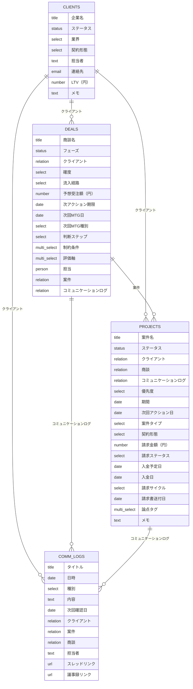

# T-03 案件・クライアントCRM — 仕様説明書

> 正本: 本リポジトリ（GitHub）。Notion 上のページは配布・レビュー用。

---

## 製品概要

| 項目 | 内容 |
| --- | --- |
| **製品名** | T-03 案件・クライアントCRM |
| **カテゴリ** | CRM / 案件管理 / フリーランス向け業務管理 |
| **形態** | Notionテンプレートページ + 4つのデータベース（リレーション連携） + 運用ガイド + API連携仕様書 |
| **ターゲット** | 複数クライアントを持つフリーランス（デザイナー / エンジニア / コンサルタント） |
| **概要** | クライアント→商談→案件→コミュニケーション履歴を一気通貫で管理し、次アクションと期限でフォロー漏れを防ぐCRMテンプレートです。 |

---

## 構成要素一覧

| **#** | **種別** | **名称** | **説明** |
| --- | --- | --- | --- |
| 1 | テンプレートページ | T-03 案件・クライアントCRM | 全体導線（README）とDB入口をまとめたハブ |
| 2 | ガイドページ | [T-03 運用方法](https://www.notion.so/T-03-ec9fcb031725824cb57681a8c0a77c1d?pvs=21) | セットアップ手順、最小運用ルール、AI活用Tips |
| 3 | ガイドページ | [T-03 API連携仕様書](https://www.notion.so/T-03-API-2b9ac2dff4364a21bcdff7e741e87c4b?pvs=21) | Notion公式API / MCP連携での自動転記仕様（JSON例、制約、前処理） |
| 4 | データベース | クライアントDB | 全DBの起点となる顧客マスター |
| 5 | データベース | 商談パイプラインDB | 受注前の判断・次アクション管理 |
| 6 | データベース | 案件DB | 受注後の実行・請求・入金までの管理 |
| 7 | データベース | コミュニケーションログDB | やり取り履歴の資産化とフォローアップ |

---

## データベース仕様

### クライアントDB — スキーマ仕様

#### 他テンプレート連携（T-04 / T-08）

**T-04 収支・請求管理DB**、**T-08 提案書・契約書DB** との連携を想定。

クライアントDBのリレーションプロパティ（提案書/契約書/請求書など）は、単体完結用というより、関連テンプレートのDBと繋げて「迷わない導線」を作るための入口。

- **提案書**：[T-08 提案書・契約書管理](https://www.notion.so/T-08-ce71a5bf6d404f66ba9c0a9f9537d5ce?pvs=21) の提案書DBのレコードに紐づける（提案〜受注までの履歴を残す）。
- **契約書**：T-08の契約書DBのレコードに紐づける（締結状況、更新期限、PDFリンクの管理）。
- **請求書**：請求書テンプレート側の請求書DBに紐づける（送付/入金の見落とし防止）。

T-03単体でも運用可能。提案〜契約まで一気通貫にする場合は T-08 連携を推奨。

#### プロパティ一覧

※ 元資料では「13項目」表記。下表は **12プロパティ**（実装時にロールアップ等で13項目になる場合は追記する）。

| **プロパティ名** | **型** | **説明** | **選択肢 / 詳細** |
| --- | --- | --- | --- |
| 企業名 | title | クライアントの企業名・個人名 | ─ |
| ステータス | status | 取引状況 | **To-do**: リード / **In Progress**: 取引中 / **Complete**: 休止, 終了 |
| 業界 | select | クライアントの業界区分 | IT / Web制作 / コンサル / 広告 / メーカー / 小売 / 飲食 / 不動産 / 教育 / その他 |
| 契約形態 | select | 契約の種類 | 準委任 / 請負 / 顧問 / スポット / その他 |
| 担当者 | text | 先方の担当者名 | ─ |
| 連絡先 | email | 主な連絡先メールアドレス | ─ |
| LTV（円） | number | 累計の取引金額（円） | 通貨: 円 |
| メモ | text | クライアントに関する自由記述メモ | ─ |
| 収支レコード | relation | このクライアントに紐づく収支レコード | 関連先: 収支レコード（双方向） |
| 契約書 | relation | このクライアントに紐づく契約書 | 関連先: 契約書（双方向） |
| 提案書 | relation | このクライアントに紐づく提案書 | 関連先: 提案書（双方向） |
| 請求書 | relation | このクライアントに紐づく請求書 | 関連先: 請求書（双方向） |

#### ビュー構成（2ビュー）

| **ビュー名** | **種別** | **フィルター** | **ソート** |
| --- | --- | --- | --- |
| クライアント一覧 | テーブル | なし | なし |
| ステータス別 | ボード | なし | 手動（ステータス列順） |

---

### 商談パイプラインDB — スキーマ仕様

#### プロパティ一覧

※ 元資料では「14項目」表記。下表は転記済み項目。ER図にある **フェーズ / 確度 / 予想受注額 / 次回MTG日 / 判断ステップ / 評価軸 / 案件** 等は Notion 実装と突き合わせて追記する。

| **プロパティ名** | **型** | **説明** | **選択肢 / 詳細** |
| --- | --- | --- | --- |
| 商談名 | title | 商談/案件の名称 | ─ |
| クライアント | relation | 紐づくクライアント | 関連先: クライアントDB（双方向） |
| 流入経路 | select | 商談の流入経路 | 紹介 / Web問い合わせ / SNS / イベント / 既存顧客 / その他 |
| 次アクション期限 | date | 次アクションの期限（締切） | 日付 |
| 次回MTG種別 | select | 次回ミーティングの種別 | 初回 / ヒアリング / 提案 / 見積 / 交渉 / クロージング |
| 制約条件 | multi_select | 意思決定・推進上の制約条件 | 予算 / 期限 / 体制 / 権限者不在 / 競合比較中 / 既存ツール縛り / 法務 / セキュリティ / その他 |
| 担当 | person | この商談の担当者 | 上限1名 |
| コミュニケーションログ | relation | この商談に紐づくコミュニケーションログ | 関連先: コミュニケーションログDB（双方向） |

#### ビュー構成（4ビュー）

| **ビュー名** | **種別** | **フィルター** | **ソート** |
| --- | --- | --- | --- |
| パイプライン | ボード | なし | 手動（フェーズ列順） |
| 売上予測テーブル | テーブル | なし | 予想受注額（円） 降順 |
| 商談一覧 | テーブル | なし | なし |
| 判断・決定整理 | テーブル | なし | なし |

---

### 案件DB — スキーマ仕様

> 注：本テンプレートでは案件DBは「受注後の実行・請求」に寄せたステータス設計です（受注前は商談パイプラインDBで管理）。

| **プロパティ名** | **型** | **説明** | **選択肢 / 詳細** |
| --- | --- | --- | --- |
| 案件名 | title | 案件/プロジェクト/取引の名称 | ─ |
| ステータス | status | 案件の進行状況 | **To-do**: 受注 / **In Progress**: 進行中, 納品待ち, 検収待ち, 請求書送付, 入金待ち / **Complete**: 完了, 中止 |
| クライアント | relation | 紐づくクライアント | 関連先: クライアントDB（双方向） |
| 商談 | relation | 紐づく商談（商談パイプラインDB） | 関連先: 商談パイプラインDB（双方向） |
| コミュニケーションログ | relation | この案件に紐づくコミュニケーションログ | 関連先: コミュニケーションログDB（双方向） |
| 優先度 | select | 対応優先度 | 高 / 中 / 低 |
| 期間 | date | 案件の開始日〜終了日（タイムライン用） | 日付範囲 |
| 次回アクション日 | date | 次にアクションを起こす日 | 日付 |
| 案件タイプ | select | 案件のタイプ | 新規制作 / 開発 / コンサル / 保守 / オプション / その他 |
| 契約形態 | select | 契約形態 | 準委任 / 請負 / 顧問 / スポット / その他 |
| 請求金額（円） | number | 請求金額（円） | 通貨: 円 |
| 請求ステータス | select | 請求関連のステータス | 未請求 / 請求書作成中 / 送付済 / 入金済 / 要確認 |
| 入金予定日 | date | 入金予定日 | 日付 |
| 入金日 | date | 実際の入金日 | 日付 |
| 請求サイクル | select | 請求のサイクル | 一括 / 月次 / 四半期 / 成果報酬 / その他 |
| 請求書送付日 | date | 請求書を送付した日 | 日付 |
| 論点タグ | multi_select | 案件の論点/論点管理タグ | 要件 / スコープ / 価格 / 契約 / 検収 / 運用 / リスク / 体制 |
| メモ | text | 自由記述メモ | ─ |

#### ビュー構成（3ビュー）

| **ビュー名** | **種別** | **フィルター** | **ソート** |
| --- | --- | --- | --- |
| 案件一覧 | テーブル | なし | 親案件 昇順 / 期間 昇順 / ステータス 昇順 |
| 親（請求単位）優先度別 | ボード | 親案件が空（親レコードのみ） | 手動（優先度列順） |

---

### コミュニケーションログDB — スキーマ仕様

#### プロパティ一覧（11項目）

| **プロパティ名** | **型** | **説明** | **選択肢 / 詳細** |
| --- | --- | --- | --- |
| タイトル | title | コミュニケーションの要約 | ─ |
| 日時 | date | 発生日時 | 日付（時刻含む運用可） |
| 種別 | select | コミュニケーションの種別 | ミーティング / メール / チャット / 電話 / その他 |
| 内容 | text | やり取りの本文・要約 | ─ |
| 次回確認日 | date | 次回フォローアップの確認日 | 日付 |
| クライアント | relation | 紐づくクライアント | 関連先: クライアントDB（双方向） |
| 案件 | relation | 紐づく案件 | 関連先: 案件DB（双方向）/ 上限1 |
| 商談 | relation | 紐づく商談 | 関連先: 商談パイプラインDB（双方向） |
| 担当者 | text | クライアント側の関係者（担当者） | ─ |
| スレッドリンク | url | スレッド・メール等へのリンク | ─ |
| 議事録リンク | url | 議事録（ミーティングメモ）へのリンク | ─ |

#### ビュー構成（3ビュー）

| **ビュー名** | **種別** | **フィルター** | **ソート** |
| --- | --- | --- | --- |
| ログ一覧 | テーブル | なし | 日時 降順 |
| カレンダー | カレンダー | なし | なし |

> 元資料では「3ビュー」とあるが、名称が未記載のビューが1つある。Notion 実装を正とし、確定したら本表に追記する。

---

## DB間リレーション図

---

## ユーザーストーリー／ワークフロー

### 基本フロー

1. **クライアントを登録**（クライアントDB）
2. **商談を登録**（商談パイプラインDB）し、フェーズ・確度・次アクション期限を更新
3. **受注後は案件を作成**（案件DB）し、請求/入金予定も更新
4. **やり取りを記録**（コミュニケーションログDB）し、次回確認日でフォローアップ
5. **週次レビュー**で商談の放置ゼロ、案件の納期/請求/入金の見落としゼロを作る

### 拡張フロー（AI・API連携）

1. 会話ログ/議事録/メールを準備
2. AIでテンプレ照合して **プロパティ候補＋本文ドラフト** を生成
3. 人は **次アクション / 期限 / 紐づけ** を確認
4. Notion公式API or MCP でJSON転記してDBに登録

---

## ユーザー向けメモ

### 活用ポイント

- 🔗 **4DBのリレーション連携** ─ クライアント→商談→案件→ログが一本の導線で繋がる
- 🧭 **受注前/受注後の役割分離** ─ 商談DB（受注前）と案件DB（受注後）で迷いが減る
- 📅 **次アクションと期限中心の運用** ─ 放置・抜け漏れを仕組みで防止
- 💬 **コミュニケーション履歴の資産化** ─ 引き継ぎや振り返りが一瞬でできる
- 🤖 **AIで入力負担を最小化** ─ サマリー→テンプレ照合→JSON転記まで拡張可能

### 前提条件・注意事項

- Notionの基本機能（データベース/リレーション）を利用します
- API連携は任意です（手動運用でも成立します）
- 自動転記を行う場合は、relationに **page_id** が必要です（URL→page_id変換）

---

## 変更・改善点（旧Verとの差分）

- **仕様説明書を新規追加**：運用方法とAPI連携を統合し、マーケットプレイス用の説明として1ページで完結する構成にしました。
- **案件DBのステータス設計を受注後に最適化**：受注前フェーズ（リード/ヒアリング/提案/交渉など）を案件DBから外し、商談パイプラインDBに集約して混乱を防ぎました。
- **案件DB ↔ コミュニケーションログDBの双方向リレーションを明示**：案件から関連ログを引けるようにし、履歴の参照性を改善しました。
- **Notion公式API仕様に合わせたJSON例を整理**：date/relation/people/status等の型の違いを明確化し、実装者がそのまま使える例に統一しました。
- **DBスキーマ/ビュー/選択肢の列挙を仕様書内に集約**：select・statusの選択肢、ビューのフィルター/ソートまで含めて、仕様の抜け漏れを減らしました。
- **AI入力（サマリー→テンプレ照合→JSON転記）の拡張フローを追加**：手入力だけでなく自動転記前提の運用導線も含めました。

---

## スキーマ差分メモ（転記時の注意）

- **商談パイプラインDB**: 上記「プロパティ一覧」は貼付資料の転記分。ER図（`DEALS`）に追加フィールドがあるため、Notion の実DBと一致させる際は `specification.md` を更新して正本を合わせる。
- **クライアントDB**: 元資料は「13項目」だが表上は12。ロールアップ等で13項目になる場合は行を追記。
- **コミュニケーションログDB**: ビュー表は「3ビュー」だが、ER図と一覧の粒度を揃えるため、必要なら第3ビュー名を実装に合わせて追記。
